# Schema generalization — decouple matching from embedding, unify encoders & coupling

**Status: IMPLEMENTED (Changes 1–3)** on `experiment/binded-vocab-strip` — see the status block in
[changes.md](changes.md) for commits and the decisions taken. This document's Architecture diagram is
the *pre-strip* target (still shows `DataManager`/`HierarchicalIndexer`/`DistributionData`); the
changes actually landed on the post-strip `compile_obs` + `schemas/` surface. Kept for the motivation
and the reference-system rationale. Part of the [roadmap](roadmap.md).

**Audience:** the next agent picking this up cold. Goal is to describe cellflow's model-init concerns
in sc-flow-tools' *own* language — **not** to import cellflow vocabulary (`split_covariates`,
`sample_covariates`, …). Those names are banned here; the mapping table is for translation only.

**One-line goal:** stop three concepts from being fused, so each can be declared independently:
(1) the **matching axis** vs the **embedded covariates**; (2) `reps` vs `encoding`; (3) linear vs
quadratic **coupling**.

---

## Motivation — three conflations to remove

1. **`groups` does double duty.** The same `groups` list feeds *both* the hierarchical matching split
   (`HierarchicalIndexer(groups_cols=...)`, [_manager.py:182](../../src/sc_flow/data/_manager.py:182))
   *and* the per-cell embedding (`GroupsDataSchema` requires every group to carry a rep/encoding,
   [_groups_data_schema.py:69](../../src/sc_flow/data/schemas/_groups_data_schema.py:69)). You cannot
   say "match within `cell_line` but don't embed it," nor "embed `batch` but don't match on it."

2. **`reps` vs `encoding` is a false split.** Both turn a categorical column into a vector; they
   differ only in *where the transform's parameters come from* — `.uns` lookup (reps) vs fit-from-data
   (`one-hot`/`label`/`functional`). Four parallel dicts (`_reps`, `_encoding`,
   `_encoding_transform_fn`, `_encoding_inverse_transform_fn`) express one idea.

3. **Coupling hard-splits lin vs quad.** `CouplingDataSchema` branches on `n_shared_dims` to pick
   comparable (linear) vs incomparable (quadratic/GW) spaces
   ([_coupling_data_schema.py:121](../../src/sc_flow/data/schemas/_coupling_data_schema.py:121)). The
   mode is *declared* rather than *inferred* from the source/target spaces.

---

## Change 1 — split the matching axis from the embedded covariates

The two roles are orthogonal; make them two independent inputs that may overlap.

- **`match_context: list[str]`** — the structural matching axis. Feeds
  `HierarchicalIndexer(groups_cols=match_context, ...)`. **No embedding implied.** This is the *only*
  driver of the hierarchical split; **no `match_context or groups` fallback** (that would silently
  re-couple the axes — the very bug we're removing).

- **`covariates` + `covariate_encoders`** *(naming open)* — the embedded per-cell covariates. Feeds
  the conditioner only; does **not** touch the indexer. The embedded set is **derived** from the
  encoder map's keys, not a separately-maintained list (today `groups` is already required to equal
  `reps.keys() ∪ encoding.keys()` — i.e. redundant).

Every covariate falls out of the two axes independently:

| in `match_context`? | has an encoder? | meaning |
|:---:|:---:|---|
| ✔ | ✘ | match only (structural, not embedded) |
| ✘ | ✔ | embed only (conditioner input, not a split) |
| ✔ | ✔ | match **and** embed (column listed in both) |
| ✘ | ✘ | not referenced |

**Why:** `control_values_dict` keys control at the *condition* level, matched *within* each
`match_context` cell — untouched. Only the indexer wiring changes (feed it from `match_context`).

**Why the rename off "groups":** "groups" meant the splitting/subpopulation role, which is now
`match_context`. What remains does one thing — encode a column into a conditioner vector — so the name
must track that. (Native name, TBD; **not** cellflow's `sample_covariates`.)

---

## Change 2 — one encoder abstraction (merge reps + encoding)

Replace the four dicts with **one map `{col: encoder}`**. An `encoder` is a fittable object exposing
the two directions `transform` / `inverse_transform` ("into two" = two directions, one object). A
`.uns` lookup becomes just another encoder whose parameters come from `.uns` rather than from the data.

Built-in factories: `one_hot()`, `label()`, `lookup(uns_key)`, `functional(fn, inv)`; any user
callable is accepted. Same abstraction then unifies `conditions_reps` (ConditionDataSchema) and the
response-covariate encoders — **one encoder concept across every schema**.

**Why:** collapses 4 parallel dicts → 1; kills the `reps`/`encoding` dispatch in
[`get_covariate_encoder`](../../src/sc_flow/data/_utils.py:57); makes "what's embedded" a single source
of truth (the map's keys), which is exactly what Change 1's derivation needs.

---

## Change 3 — coupling as `srcs`/`tgts` references, lin/quad inferred

Model coupling with the **`anndata.acc` reference system** (`from anndata.acc import A`), *not*
pandas-style namespaces. An `AdRef` names an array location portably (`A.obsm["X_pca"]`,
`A.X[:, "g"]`, `A.obsm["spatial"][:, :k]`), materializes with `adata[ref]`, and checks presence with
`ref in adata`. It round-trips from a string via `A.resolve("X_pca")`, so a bare `.obsm` key stays a
valid input. (On anndata **main**, unreleased — env has 0.12.9; version-bump-gated. Also works on
MuData.)

Replace `source_rep` / `target_rep` / `n_shared_dims` with **separate lin/quad references** —
`src_lin`, `src_quad`, `tgt_lin`, `tgt_quad` (each an `AdRef`, or a `str` resolved to one). **No
slicing, no `n_shared_dims`:** the batch already carries the linear and quadratic reps as distinct
arrays, so each is just its own reference (`CouplingData` already holds `state_lin`/`state_quad`).

- **lin vs quad is inferred, not declared:** which of `*_lin` / `*_quad` are provided determines the
  regime — `*_quad` present → quadratic/GW, else linear. The schema stops branching on a mode flag;
  the solver decides from what's present.

### `CouplingData` (and the whole in-memory container path) dissolves

In the streaming target there is **no materialized whole-dataset coupling** — OT coupling is a
*per-minibatch* operation computed in the training step. So the `CouplingData` container (whose
`init_from_state_data`/`concat_collection`/slicing all serve whole-data compilation) is **not needed**;
the lin/quad reps become **optional batch keys** the loader attaches *only when the coupling space
differs from the state rep* (same-space linear matching just reuses `src_cell_data`/`tgt_cell_data` —
no extra array). This is not a new decision: `CouplingData` retires alongside `DistributionData` /
`NestedData` / `MatchedData` / `MappedLevelIndex` — the in-memory compile path that
[sc-flow-refactor.md](sc-flow-refactor.md) Track A already earmarks for streaming replacement. Net:
coupling collapses to **spec references → optional batch keys** (`{..., src_lin, src_quad, tgt_lin,
tgt_quad}`), with no `CouplingDataSchema`/`CouplingData` in between.

**Why:** one abstraction ("match `srcs` to `tgts`") covers both regimes; `adata[ref]` replaces
[`_extract_array`](../../src/sc_flow/data/schemas/_coupling_data_schema.py:78) and `ref in adata`
replaces `_check_key_found_in_adata_field` — no `.obsm`-vs-`.X` branching.

### The deeper lever — references across *all* schemas

The `.obsm`-key-else-`.X` pattern is everywhere: `sample_rep` (`StateDataSchema`), condition columns,
covariate columns. Each is really **"this field is an `AdRef`."** Adopting references uniformly
collapses `_extract_array` + presence-checks + obsm/X branching across the whole schema layer into
"resolve a reference." Coupling is the first place it pays off; the rest is a follow-on once anndata
is bumped.

---

## Architecture — target state (`*` = provisional name, see Open decisions)

```mermaid
classDiagram
    direction TB

    %% ========= A. SPEC — the schemas you author =========
    class StrictDataSchema {
        <<abstract>>
        +get_data(adata) container
        #_verify_args()
        #_verify_schema(adata)
    }
    class StateDataSchema {
        +sample_rep
    }
    class ConditionDataSchema {
        +conditions
        +condition_encoders
        +conditions_covariates
        +all_condition_cols
    }
    class CovariatesDataSchema {
        +covariate_encoders
        +covariates_derived
    }
    class ResponseDataSchema {
        +response_encoders
        +continuous_covs
    }
    class CouplingDataSchema {
        +src_lin
        +src_quad
        +tgt_lin
        +tgt_quad
    }
    StrictDataSchema <|-- StateDataSchema
    StrictDataSchema <|-- ConditionDataSchema
    StrictDataSchema <|-- CovariatesDataSchema
    StrictDataSchema <|-- ResponseDataSchema
    StrictDataSchema <|-- CouplingDataSchema

    %% AdRef typing (anndata.acc) conveyed via relations, not inline types
    class AdRef {
        <<anndata.acc>>
    }
    StateDataSchema ..> AdRef : sample_rep
    CouplingDataSchema ..> AdRef : src/tgt _lin/_quad

    %% ========= A2. ENCODER — one abstraction (Change 2) =========
    class Encoder {
        <<abstract>>
        +fit(col, side_data)
        +transform(x)
        +inverse_transform(x)
    }
    class OneHot
    class Label
    class Lookup {
        +uns_key
    }
    class Functional {
        +fn
        +inv
    }
    Encoder <|-- OneHot
    Encoder <|-- Label
    Encoder <|-- Lookup
    Encoder <|-- Functional
    ConditionDataSchema o-- Encoder : condition_encoders
    CovariatesDataSchema o-- Encoder : covariate_encoders
    ResponseDataSchema o-- Encoder : response_encoders

    %% ========= B. ORCHESTRATION — DataManager wiring =========
    class DataManager {
        +match_context
        +compile_adata(adata) NestedData
        +get_distribution_data(adata) DistributionData
        +get_data_dimensionalities(adata) DataDimensionalitiesRegistry
        -_get_source_key(control_values_dict)
    }
    class HierarchicalIndexer {
        +groups_cols
        +conditions_cols
        +create_index(df) MultiIndex
    }
    class IndexSelector {
        +index_to_nested_dict(index) MappedLevelIndex
    }
    class QueryFactory
    class DataPreprocessor {
        +fit(dist)
        +transform(dist) DistributionData
    }

    DataManager *-- StateDataSchema
    DataManager *-- ConditionDataSchema
    DataManager *-- CovariatesDataSchema
    DataManager *-- ResponseDataSchema
    DataManager *-- CouplingDataSchema
    DataManager *-- HierarchicalIndexer
    DataManager *-- IndexSelector
    DataManager *-- DataPreprocessor
    IndexSelector *-- QueryFactory
    IndexSelector ..> HierarchicalIndexer : init_from_indexer

    %% DECOUPLED: match_context drives the split; covariates only embed
    DataManager --> HierarchicalIndexer : groups_cols = match_context
    ConditionDataSchema --> HierarchicalIndexer : conditions_cols = all_condition_cols

    %% ========= C. CONTAINERS — produced during compile =========
    class StateData {
        +X
    }
    class CategoricalData {
        +ann_df
        +repr_dict
        +categorical_encoders
    }
    class MixedTypeData {
        +categorical_covariates
        +continuous_covariates
    }
    class CouplingData {
        +state_lin
        +state_quad
    }
    class DistributionData {
        +state_data
        +condition_data
        +response_data
        +covariates_data
        +source_coupling_data
        +target_coupling_data
    }
    class MappedLevelIndex
    class MatchedData {
        +target_distribution
        +source_distribution
    }
    class NestedData
    class DataDimensionalitiesRegistry {
        +state_dim
        +condition_reps_dims
        +covariate_reps_dims
    }

    StateDataSchema ..> StateData : get_data
    CovariatesDataSchema ..> CategoricalData : get_data
    ConditionDataSchema ..> MixedTypeData : get_data
    ResponseDataSchema ..> MixedTypeData : get_data
    CouplingDataSchema ..> CouplingData : get_data

    DistributionData *-- StateData : state
    DistributionData *-- CategoricalData : covariates
    DistributionData o-- MixedTypeData : condition
    DistributionData o-- MixedTypeData : response
    DistributionData o-- CouplingData : source/target
    MixedTypeData *-- CategoricalData

    DataManager ..> DistributionData : builds
    DataManager ..> NestedData : compile_adata
    DataManager ..> DataDimensionalitiesRegistry : dims
    IndexSelector ..> MappedLevelIndex : produces

    NestedData *-- MatchedData : leaves
    NestedData ..> MappedLevelIndex : init_from_data
    MatchedData o-- DistributionData : target/source slices

    %% ========= D. LOADER — the sampler artifact =========
    class Sampler {
        <<abstract>>
        +tree
        +sample()
    }
    class TrainSampler {
        +batch_size
        +n_nodes
    }
    class ValidationSampler {
        +max_n_obs
        +n_nodes
    }
    Sampler <|-- TrainSampler
    Sampler <|-- ValidationSampler
    Sampler o-- NestedData : tree

    note for HierarchicalIndexer "DECOUPLED (was FUSION) — groups_cols now comes\nfrom DataManager.match_context (matching only).\nCovariatesDataSchema no longer feeds the split;\nit only produces CategoricalData (embedding).\nTwo independent inputs, may overlap by column."
```

---

## Naming (native — no cellflow vocab)

| role | old | proposed | status |
|---|---|---|---|
| matching axis | `groups` (as split) | `match_context` | **locked** |
| embedded covariates | `groups` + reps/encoding | `covariates` | open |
| the encoder map | `_reps`/`_encoding`/fn dicts | `covariate_encoders` / `encoder` | open |
| coupling views | `source_rep`/`target_rep`/`n_shared_dims` | `srcs` / `tgts` (`AdRef`) | open |

*Translation only (do not adopt): cellflow `split_covariates`→`match_context`,
`sample_covariates`→`covariates`, `perturbation_covariates`→`conditions`.*

---

## Open decisions (maintainer)

1. **Embedded-covariates name:** `covariates`? `context_covariates` clashes with `match_context`.
2. **Encoder shape:** one `{col: encoder}` map with both directions bundled (recommended) vs. two
   literal maps `encoders` + `decoders`.
3. **Coupling `srcs`/`tgts` type & anndata bump:** adopt `anndata.acc` `AdRef` now (needs the anndata
   version bump off 0.12.9 to a build shipping `anndata.acc`), or ship `srcs`/`tgts` as `str`-only and
   fold in references later? And: adopt references *only* in coupling first, or sweep the whole schema
   layer (`sample_rep`, conditions, covariates) in the same pass?
4. **Migration:** hard rename (this is `feat/refactors`, pre-release) vs. keep `groups`/`*_reps`
   deprecated shims? Repo is pre-release ⇒ hard rename is likely fine.

---

## Touch list (once decisions land)

- `_manager.py` — add `match_context`; wire indexer from it; drop `groups`→indexer coupling.
- `schemas/_groups_data_schema.py` → renamed embedded-covariates schema; derive set from encoder map.
- `schemas/_coupling_data_schema.py` — `srcs`/`tgts`; drop `n_shared_dims` branch.
- `data/_utils.py` + `_types.py` — encoder abstraction (add `lookup`); retire `TargetCovariatesEncodingId` dispatch.
- `schemas/_condition_data_schema.py`, `_response_data_schema.py` — adopt the same encoder map.
- Parity tests (`test_compile_obs` et al.) — update to the new surface; keep the cellflow-parity numbers.
